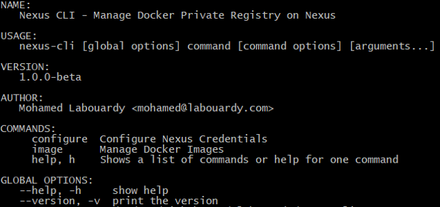

[](https://circleci.com/gh/mlabouardy/nexus-cli) [](LICENSE)

<div align="center">

</div>

Nexus CLI for Docker Registry

## Usage

<div align="center">

</div>


## Download

### Linux

```bash
$ wget https://github.com/f9n/nexus-cli/releases/download/v1.1.0/nexus-cli_1.1.0_Linux_x86_64.tar.gz
$ tar xvfz nexus-cli_1.1.0_Linux_x86_64.tar.gz
$ mv nexus-cli /usr/local/bin
$ nexus-cli --version
```

### Darwin

```bash
$ export VERSION="1.1.0"
$ wget https://github.com/f9n/nexus-cli/releases/download/v${VERSION}/nexus-cli_${VERSION}_Darwin_x86_64.tar.gz
$ tar xvfz nexus-cli_${VERSION}_Darwin_x86_64.tar.gz
$ mv nexus-cli /usr/local/bin
$ nexus-cli --version
```

## Installation

To install the library and command line program, use the following:

```bash
$ go get -u github.com/f9n/nexus-cli
```

## Available Commands

```bash
$ nexus-cli configure
```

```bash
$ nexus-cli image ls
$ nexus-cli image ls --detail
$ nexus-cli image ls --sort-by-size
```

```bash
$ nexus-cli image tags -name mlabouardy/nginx
```

```bash
$ nexus-cli image info -name mlabouardy/nginx -tag 1.2.0
```

```bash
$ nexus-cli image delete -name mlabouardy/nginx
$ nexus-cli image delete -name mlabouardy/nginx -tag 1.2.0
$ nexus-cli image delete -name mlabouardy/nginx -keep 4
```

```bash
$ nexus-cli image size -name mlabouardy/nginx
$ nexus-cli image size -name mlabouardy/nginx --human-readable
```
## Tutorials

* [Cleanup old Docker images from Nexus Repository](http://www.blog.labouardy.com/cleanup-old-docker-images-from-nexus-repository/)
